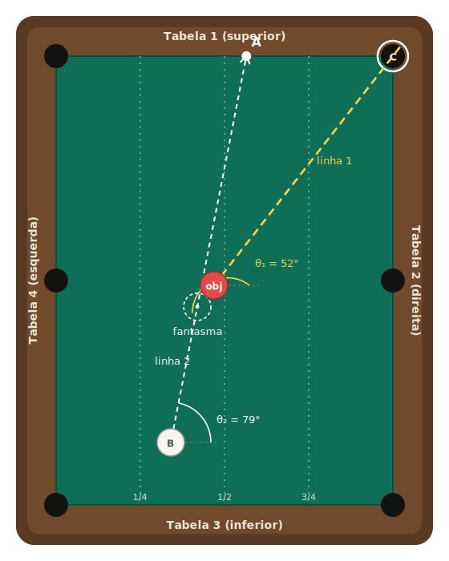
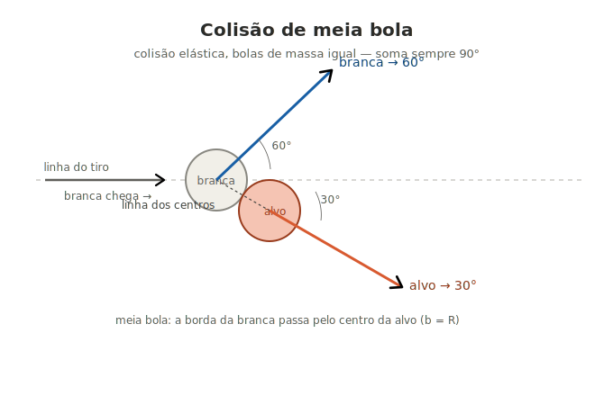

# Sinuca — Calculadora do ponto A

Aplicativo HTML de página única para visualizar a mira em tacadas de corte na sinuca. Você posiciona a bola objeto e a branca, escolhe a caçapa alvo, e o app desenha a linha de mira e o **ponto A** — o lugar na tabela onde você deve apontar o taco.

<p align="center">
  
</p>

Sem dependências, sem build, sem servidor. É um único arquivo `sinuca.html` que roda em qualquer navegador.

## A ideia

Numa tacada de corte, a bola objeto sai na direção da linha que liga o ponto de contato ao seu centro. Para ela cair na caçapa, a branca precisa atingi-la vindo da direção certa. O método aqui usa três elementos:

- **Linha 1** (amarela): vai da caçapa alvo até a bola objeto. É a direção em que a objeto precisa sair.
- **Bola fantasma**: uma cópia imaginária da branca, encostada na objeto do lado oposto à caçapa, a um diâmetro de distância do centro. É onde a branca precisa estar no instante do impacto.
- **Linha 2** (branca): a reta de tacada, que sai da branca e passa pelo **centro da fantasma**, prolongando-se até a tabela.

O **ponto A** é onde a linha 2 encontra a tabela. Mirar o taco em A produz o corte correto.

## O que o app mostra

- Mesa com 6 caçapas (4 cantos + 2 no meio das tabelas longas) e as quatro tabelas numeradas (1 superior, 2 direita, 3 inferior, 4 esquerda).
- Caçapa alvo **C** destacada, selecionável por botões.
- Bola objeto (vermelha) e branca (B), ambas arrastáveis dentro do feltro.
- Linha 1, linha 2, bola fantasma e ponto A desenhados conforme a posição das bolas.
- Ângulos medidos contra a horizontal: **θ₁** (linha 1) na objeto e **θ₂** (linha 2) na branca, com o valor numérico ao lado.
- Painel de leitura: θ₁, θ₂, a fração da tabela onde A cai, e o ângulo de corte (0° = tacada reta).
- Grade de frações (1/4, 1/2, 3/4) para estimar posições a olho.

## Como usar

1. Abra o `sinuca.html` no navegador (duplo clique ou arraste para uma aba).
2. Escolha a caçapa alvo no painel à direita.
3. Arraste a bola objeto e a branca para a situação que quer estudar.
4. Leia o ponto A na tabela e os ângulos no painel.

Os controles permitem ligar/desligar a bola fantasma, os ângulos e a grade de frações. O botão "Voltar ao padrão" restaura a posição inicial.

## Geometria

O ponto A é calculado por interseção da reta de tacada (branca → centro da fantasma) com a primeira tabela que ela encontra. O cálculo é trigonométrico — a fantasma serve de apoio visual e como ponto pelo qual a reta passa. A precisão foi validada comparando o A desenhado com um cálculo independente, em todas as seis caçapas e em várias posições de bola.

As entradas que determinam A são: a posição da objeto (que fixa θ₁ junto com a caçapa), a posição da branca, e as dimensões da mesa.

## A meia bola

Na **meia bola**, o centro da branca aponta para a **borda** da bola alvo. Nessa jogada, a alvo sai a **30°** da linha do tiro e a branca a **60°**, para o lado oposto — somando 90°, como em toda colisão elástica entre bolas de mesma massa.

<p align="center">
  
</p>

## Estrutura

```
sinuca.html   — o app inteiro (HTML + CSS + JS, sem dependências)
diagram.svg   — diagrama estático do método (usado no README)
meia-bola.svg — diagrama da meia bola (usado no README)
README.md     — este arquivo
```

## Licença

Uso livre.

---

Feito com Claude Code. Lorenzo ajudou.
